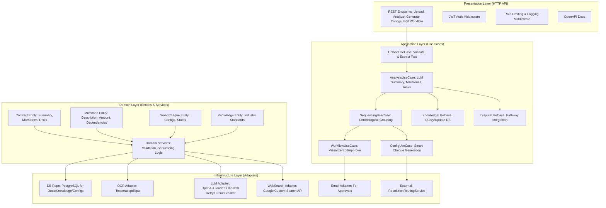

# Software Design Document: Contract Analysis and Milestone Extraction Microservice

## 1. Introduction

### 1.1 Purpose

This document outlines the detailed software design for the Contract Analysis
and Milestone Extraction microservice.

It is a standalone Go-based system that automates the analysis of
buyer-seller contracts to extract payment milestones.

The system performs risk assessments, ensures compliance, and generates
Smart Cheque configurations.

The design adheres to the requirements in `requirements.md`.

It emphasizes clean architecture principles (SOLID, dependency inversion),
modularity, 95%+ test coverage.

It includes resilience patterns (retries, circuit breakers), and
production-ready features like JWT auth.

Features include middleware and OpenAPI documentation.

The service exposes REST APIs for integration with the Smart Payment Infrastructure.

It supports contract uploads in multiple formats (with OCR).

It leverages external LLMs (e.g., OpenAI GPT-4o, Anthropic Claude).

It maintains an industry knowledge database.

It integrates with existing dispute resolution services.

It uses Go 1.21+ for its concurrency model (goroutines/channels).

It uses standard library for HTTP, and third-party libs for specific needs.

Libs include pdfcpu for PDF handling, Qwen API client for OCR, OpenAI SDK.

### 1.2 Scope

- **In Scope**: Document upload/validation/extraction, LLM-based analysis
  (summary, milestones, risks, compliance).

  Milestone sequencing/grouping, knowledge DB management (queries/updates).

  Smart Cheque config generation, workflow visualization/editing
  (Mermaid + drag-drop via frontend integration).

  Collaborative approvals, dispute pathway integration, logging/monitoring,
  HTTP server with middleware.

- **Out of Scope**: Full frontend implementation (assume API-driven UI like React with drag-drop libs).

  XRPL escrow direct interaction (delegate to external Smart Cheque service).

  Real-time notifications beyond email (use existing infra).

- **Assumptions**: Go modules for dependency management.

  PostgreSQL for persistent storage (documents, DB knowledge, configs).

  Redis for caching/rate limiting.

  External services (LLM APIs, Qwen for OCR, web search via Google API or
  similar) are available with API keys in env vars.

### 1.3 Design Principles

- **Clean Architecture**: Layers: Entities (domain models), Use Cases
  (application services).

  Interfaces (adapters), Infrastructure (external impls).

- **SOLID Compliance**: Single responsibility (e.g., separate upload vs. analysis services).

  Open/closed (interfaces for LLMs), Liskov substitution (retryable clients).

  Interface segregation (narrow contracts), Dependency inversion
  (inject deps via interfaces).

- **Error Handling**: Custom error types (e.g., `ErrInvalidContract`).

  Structured JSON responses, logging with context (correlation IDs).

- **Concurrency**: Goroutines for parallel OCR/LLM calls, channels for
  milestone sequencing.

- **Security**: JWT for auth (roles: user, analyst, admin).

  Input validation (multipart form limits), secure storage (encrypted docs).

  Rate limiting (e.g., 10 req/min per IP).

- **Observability**: Structured logging (Zap), metrics (Prometheus), tracing (OpenTelemetry).

  Health checks.

## 2. System Architecture

### 2.1 High-Level Overview

The system follows a hexagonal (ports and adapters) architecture to decouple
core logic from externalities.

Core domain logic (milestone extraction, risk assessment) is independent of
HTTP, DB, or LLM impls.

Mermaid diagram for overall flow:



### 2.2 Layers Breakdown

- **Presentation**: Gin framework for HTTP server.

  Middleware chain: recovery, CORS, auth, rate limit (golang.org/x/time/rate),
  logging (go.uber.org/zap).

- **Application**: Interfaces for use cases (e.g., `type Analyzer interface{Analyze(ctx context.Context, text string) (*ContractSummary, error)}`).

  Orchestrates domain calls.

- **Domain**: Immutable structs (e.g., `type Milestone struct{ID string; Amount decimal.Decimal; ...}`).

  Business rules (e.g., percentages sum to 100%).

- **Infrastructure**: Repos (GORM for ORM), adapters (e.g., `openai.Client` with resilience via
  github.com/sony/gobreaker).

### 2.3 Deployment Architecture

- Containerized (Docker); orchestrated with Kubernetes/Docker Compose.

- Env: Dev (in-memory DB), Prod (Postgres + Redis).

- CI/CD: GitHub Actions for lint (golangci-lint), test (go test -cover),
  build (go build).

## 3. Data Models

All models use Go structs with JSON tags for API serialization.

Use `github.com/shopspring/decimal` for precise amounts; `time.Time` for timestamps.

### 3.1 Core Entities

```go
// Contract represents the analyzed contract.
type Contract struct {
    ID          string                 `json:"id" gorm:"primaryKey"`
    Hash        string                 `json:"contract_hash"`
    Summary     *ContractSummary       `json:"summary"`
    Milestones  []*Milestone           `json:"milestones"`
    Risks       []*RiskAssessment      `json:"risks"`
    Compliance  *ComplianceReport      `json:"compliance"`
    KnowledgeID string                 `json:"knowledge_id"`
    Confidence  float64                `json:"confidence_score"`
    Status      ContractStatus         `json:"status"` // e.g., "validated", "analyzed"
    CreatedAt   time.Time              `json:"created_at"`
    UpdatedAt   time.Time              `json:"updated_at"`
}

// ContractSummary holds key extracted info.
type ContractSummary struct {
    BuyerName    string `json:"buyer_name"`
    SellerName   string `json:"seller_name"`
    GoodsNature  string `json:"goods_nature"` // "physical", "digital", "services"
    TotalValue   decimal.Decimal `json:"total_value"`
    Currency     string         `json:"currency"` // "USDT", "USDC", "e₹"
    Jurisdiction string         `json:"jurisdiction"`
}

// Milestone represents a payment obligation.
type Milestone struct {
    ID             string            `json:"id" gorm:"primaryKey"`
    Description    string            `json:"description"`
    Amount         decimal.Decimal   `json:"amount"`
    Percentage     float64           `json:"percentage"`
    Trigger        string            `json:"trigger_condition"`
    SequenceOrder  int               `json:"sequence_order"`
    Dependencies   []string          `json:"dependencies"`
    Category       string            `json:"category"` // functional group
    Verification   VerificationMethod `json:"verification_method"`
    OracleConfig   *OracleConfig     `json:"oracle_config,omitempty"`
}

// VerificationMethod enum-like.
type VerificationMethod string

const (
    Manual   VerificationMethod = "manual"
    Oracle   VerificationMethod = "oracle"
    Hybrid   VerificationMethod = "hybrid"
    API      VerificationMethod = "api" // e.g., logistics
)

// OracleConfig for oracle integration.
type OracleConfig struct {
    Endpoint string `json:"endpoint"`
    APIKey   string `json:"api_key"` // encrypted
}

// RiskAssessment for vulnerabilities.
type RiskAssessment struct {
    ID        string `json:"id" gorm:"primaryKey"`
    Type      string `json:"type"` // "buyer", "seller"
    Severity  Severity `json:"severity"` // "low", "medium", "high", "critical"
    Description string `json:"description"`
    Recommendation string `json:"recommendation"`
    IndustryRef string `json:"industry_reference"`
}

type Severity string

const (
    Low      Severity = "low"
    Medium   Severity = "medium"
    High     Severity = "high"
    Critical Severity = "critical"
)

// ComplianceReport for legal checks.
type ComplianceReport struct {
    MissingClauses []string `json:"missing_clauses"`
    Suggestions    []string `json:"suggestions"`
    IsCompliant    bool     `json:"is_compliant"`
    Report         string   `json:"report"`
}

// SmartChequeConfig generated from milestones.
type SmartChequeConfig struct {
    ID          string         `json:"id" gorm:"primaryKey"`
    PayerID     string         `json:"payer_id"`
    PayeeID     string         `json:"payee_id"`
    Amount      decimal.Decimal `json:"amount"`
    Currency    string         `json:"currency"`
    Milestones  []*Milestone   `json:"milestones"`
    ContractHash string        `json:"contract_hash"`
    Status      ChequeStatus   `json:"status"` // "created", "locked",
    // "in_progress", "completed", "disputed"
    DisputePath DisputePath    `json:"dispute_path"`
    CreatedAt   time.Time      `json:"created_at"`
}

type ChequeStatus string

const (
    Created     ChequeStatus = "created"
    Locked      ChequeStatus = "locked"
    InProgress  ChequeStatus = "in_progress"
    Completed   ChequeStatus = "completed"
    Disputed    ChequeStatus = "disputed"
)

type DisputePath struct {
    Method     string   `json:"method"` // "mutual_agreement", "mediation", etc.
    Priority   string   `json:"priority"` // "low", "normal", "high", "urgent"
    Category   string   `json:"category"` // "payment", "breach", etc.
    Transitions []string `json:"state_transitions"` // e.g., "initiated", "under_review"
}

// KnowledgeEntry for industry DB.
type KnowledgeEntry struct {
    ID           string    `json:"id" gorm:"primaryKey"`
    Industry     string    `json:"industry"`
    Jurisdiction string    `json:"jurisdiction"`
    Type         string    `json:"type"` // "regulation", "best_practice"
    Content      string    `json:"content"`
    Version      string    `json:"version"`
    UpdatedAt    time.Time `json:"updated_at"`
    Source       string    `json:"source"` // web URL or internal
}
```

### 3.2 DTOs for API

- Request: `type UploadRequest struct{File multipart.FileHeader`form:"file"`}`

- Response: Wrap entities in `type APIResponse[T any] struct{Data T`json:"data"`; Error *APIError`json:"error,omitempty"`}`

## 4. API Design

### 4.1 Endpoints

Use Gin router; base path `/api/v1`. All endpoints require JWT auth
(except health/upload?).

- **POST /contracts/upload**: Upload document (multipart/form-data).

  Returns contract ID and validation status. (Req 1)

- **GET /contracts/{id}**: Retrieve contract summary/milestones/risks. (Req 2,3,4)

- **POST /contracts/{id}/analyze**: Trigger full analysis (LLM, sequencing, risks).

  Async via job queue? Returns job ID. (Req 2,3,4,6)

- **GET /contracts/{id}/analysis-results**: Poll for results (summary, milestones, compliance). (Req 2,6)

- **POST /contracts/{id}/risk-assessment**: Run vulnerability check. (Req 4)

- **GET /knowledge/{industry}**: Query industry best practices. (Req 4,12)

- **POST /knowledge/update**: Admin: Web search and update DB. (Req 12)

- **GET /contracts/{id}/workflow**: Get Mermaid diagram. (Req 8)

- **PUT /contracts/{id}/workflow**: Edit milestones (JSON body with reordered array).

  Validates sum=100%. (Req 8)

- **POST /contracts/{id}/approve-workflow**: Collaborative approval (body: {approved: bool, comments: string}).

  Sends email. (Req 9)

- **POST /contracts/{id}/smart-cheques**: Generate configs post-approval. (Req 5,10,11)

- **GET /smart-cheques/{cheque_id}**: Retrieve config/status. (Req 5,10)

- **POST /disputes/suggest**: Suggest pathways for contract. (Req 7)

- **Health**: GET /health (checks DB, LLM connectivity). (Req 14,15)

- **Admin**: POST /admin/update-knowledge (periodic cron). (Req 12)

### 4.2 OpenAPI Spec

Auto-generated via `github.com/swaggo/gin-swag`.

Example annotation:

```go
// @Summary Upload Contract
// @Accept multipart/form-data
// @Produce json
// @Param file formData file true "Contract file"
// @Success 200 {object} APIResponse[string]
// @Router /contracts/upload [post]
func UploadContract(c *gin.Context) { ... }
```

Serve at `/swagger/index.html`.

### 4.3 Error Responses

```json
{
  "error": {
    "code": "INVALID_FILE",
    "message": "File exceeds 10MB",
    "details": {...}
  }
}
```

## 5. Component Design

### 5.1 Upload and Extraction (Req 1)

- **Service**: `UploadService` impl `Uploader interface{UploadAndExtract(ctx context.Context, file io.Reader, format string) (*ExtractedText, error)}`

- **Impl**: Check size/format (mimetypes); OCR if image/PDF using cloud vision
  models like Qwen API (github.com/ledongthuc/pdf for text PDFs, Qwen for
  scanned/images).

- **Storage**: Save original to S3-like (minio) or FS; text to DB with
  confidence (from OCR/LLM).

- **Validation**: LLM call to check if contract (prompt: "Is this a valid
  buyer-seller contract? Extract parties/obligations.").

### 5.2 Analysis and Extraction (Req 2)

- **Service**: `AnalyzerService` with `AnalyzeText(ctx context.Context, text string) (*ContractSummary, []*Milestone, error)`

- **LLM Integration**: Use `github.com/openai/openai-go` or `github.com/anthropic-ai/sdk`.

  Prompt engineering for summary/obligations (e.g., "Extract buyer/seller,
  total value, payment clauses with amounts/conditions.").

- **Retry**: Exponential backoff (3 attempts), fallback to Claude if GPT fails.

- **Percentage Calc**: If % based, `amount = total * percentage / 100`.

### 5.3 Milestone Organization (Req 3)

- **Service**: `SequencerService` sorts milestones by timeline
  (LLM-derived dates or order).

  Groups by category (e.g., "delivery", "payment").

  Assigns % (normalize to sum 100%).

  Validates deps (DAG check via graph lib like gonum/graph).

- **Conflict Flag**: If cycle in deps, return error with details.

### 5.4 Risk and Knowledge (Req 4,12)

- **DB Schema**: Table `knowledge_entries` as above; indexes on
  industry/jurisdiction.

- **Service**: `KnowledgeService` queries DB first; if miss, web search (github.com/rocketlaunchr/google-search).

  Store with version/timestamp.

- **Periodic Update**: Cron job (github.com/robfig/cron) schedules based on volatility.

  Config map: {"finance": "daily", "tech": "weekly"}.

- **Assessment**: Prompt LLM with DB standards: "Compare contract to these best
  practices: [db_content]. Flag risks by severity."

### 5.5 Smart Cheque Generation (Req 5,11)

- **Service**: `ConfigGenerator` maps milestones to SmartChequeConfig;
  injects dispute paths.

- **States**: FSM-like (github.com/Loopring/relay-lib/fsm? or custom);
  transitions on events (approve → locked).

- **Activation**: API call to external XRPL service for escrow.

### 5.6 Compliance Checks (Req 6)

- **Service**: `ComplianceService` uses jurisdiction from summary; query
  knowledge for clauses.

  Suggest additions via LLM ("Suggest clauses for [jurisdiction] missing [gaps].").

### 5.7 Dispute Pathways (Req 7)

- **Service**: `DisputeService` analyzes contract (value/complexity via LLM),
  suggests from enum.

  Integrate with ResolutionRoutingService (HTTP client call).

- **Integration**: On dispute, POST to external /disputes with
  category/priority; freeze via status update.

### 5.8 Workflow Visualization and Editing (Req 8)

- **Visualization**: Generate Mermaid from milestones: `graph TD; M1 --> M2;`
  (string builder).

- **Editing**: API accepts JSON patch; validate logic (sum %, deps acyclic);
  store as JSONB in DB.

- **Drag-Drop**: API supports; frontend assumed to handle UI.

### 5.9 Collaborative Approval (Req 9)

- **Service**: `ApprovalService` sends email (github.com/jordan-wright/email)
  with diff (jsonpatch lib).

  Tracks approvals in DB (pending/approved/rejected).

### 5.10 Logging and Monitoring (Req 12,13,14)

- **Logging**: Zap for structured logs; correlation ID via middleware
  (github.com/google/uuid).

- **Metrics**: Prometheus client_golang; expose /metrics.

- **Alerts**: Integrate with external (e.g., Slack webhook on errors).

- **Tests**: Unit (mock interfaces), integration (testcontainers for DB),
  coverage via go test.

### 5.11 HTTP Server (Req 14)

- **Framework**: Gin for routing; graceful shutdown (signal.Notify).

- **Middleware**: Custom chain; JWT (github.com/golang-jwt/jwt); rate limit;
  tracing (opentelemetry-go).

- **Health**: /health checks DB ping, LLM health (mockable endpoint).

## 6. Database Design

- **DB**: PostgreSQL; schema via migrations (github.com/golang-migrate/migrate).

- **Tables**:

  - `contracts` (as entity)
  - `milestones` (FK to contract)
  - `smart_cheque_configs` (FK to contract)
  - `knowledge_entries`
  - `approvals` (for workflow changes: contract_id, user_id, status)
  - `logs` (optional, for audits: jsonb events)

- **Indexes**: On contract_id, industry, status for queries.

- **Constraints**: Check total % = 100 for milestones.

## 7. External Dependencies and Integrations

- **LLMs**: OpenAI/Claude APIs; env: OPENAI_API_KEY.

- **OCR**: Qwen cloud vision model API (e.g., Qwen-VL via Alibaba DashScope).

- **Web Search**: Google Custom Search JSON API.

- **Email**: SMTP or SendGrid.

- **Dispute Service**: HTTP client to ResolutionRoutingService (baseURL in config).

- **Libs**: gin-gonic/gin, gorm.io/gorm, go.uber.org/zap,
  github.com/shopspring/decimal.

  github.com/robfig/cron, swaggo/gin-swag.

- **Resilience**: Circuit breaker for external calls; retry with backoff (github.com/cenkalti/backoff).

## 8. Testing Strategy

- **Unit Tests**: 80%+ coverage; mock interfaces (github.com/stretchr/testify/mock).

- **Integration**: Test API with Gin test mode; DB with testcontainers-go.

- **E2E**: Upload sample contract, assert milestones extracted.

- **Security**: OWASP scans; fuzzing for inputs.

- **Load**: JMeter for rate limiting.

## 9. Deployment and Operations

- **Dockerfile**: Multi-stage build; expose 8080.

- **Config**: Viper for env/yaml (ports, keys, DB URL).

- **Monitoring**: Prometheus + Grafana; logs to ELK.

- **Scaling**: Horizontal pods; stateless except DB.

- **Versioning**: Semantic; API v1 fixed.

This design ensures maintainability, scalability, and alignment with
requirements.

Future iterations can refine based on prototypes.

